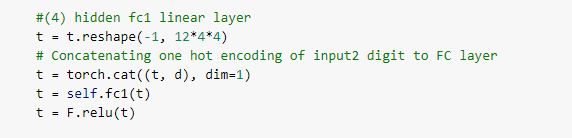
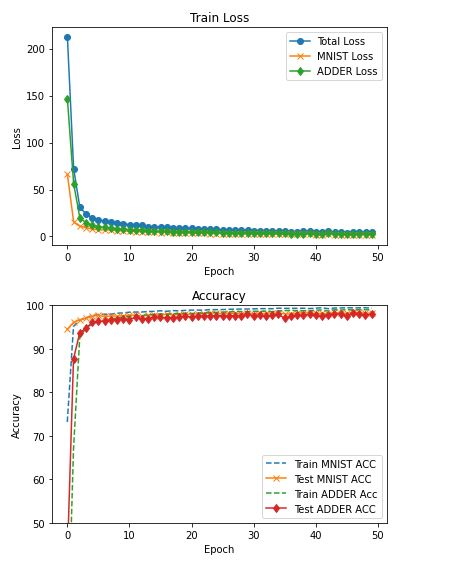

# PyTorch Assignment 

### Dataset Details:

- an image from MNIST Dataset (Input),
- a one hot vector of a randomly generated number using RandInt function between 0 and 9 (Input),
- a label for the image but represented in Binary. Since max MNIST digit is 9 hence **four bits** are enough to represent the number. (Output)
- Sum of MNIST Digit and Random Number represented in Binary. Max addition output is 18 hence **5 bits(Neurons)** is enough to represent the result.  (Output)

### Concat flattened Image output from Conv2d with One hot Encoded Random number  

### Train Loss for MNIST and Adder and Accuracy details

### Sample Outputs 

