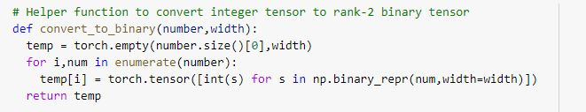

# PyTorch Assignment 

### Dataset Details:

- an image from MNIST Dataset (Input),
- a one hot vector of a randomly generated number using RandInt function between 0 and 9 (Input),
- a label for the image but represented in Binary. Since max MNIST digit is 9 hence **four bits** are enough to represent the number. (Output)
- Sum of MNIST Digit and Random Number represented in Binary. Max addition output is 18 hence **5 bits(Neurons)** is enough to represent the result.  (Output)

### Concat flattened Image output from Conv2d with One hot Encoded Random number  

### Convert labels and summation result into binary

### Binary Cross Entropy Loss Function

Binary Cross Entropy is the negative average of the log of corrected predicted probabilities. We have a case of multi-label classification since the putput are binary number representation of actual decimal digits. So BCE function is the apt loss function to be used over here. Once loss is calculated it is backword propagated via chain rule to adjust the weights of parameters. The optimization is repeated for multiple EPOCHs to get reasonable accuracy.

### Max Accuracy on training for 50 epochs on Batch Size of 200 using Adam optimizer
- Training Max accuracy on MNIST Digit Classification - 99.4  
- Training Max accuracy on Adder function - 99 
- Testing Max accuracy on MNIST Digit Classification - 98.1  
- Testing Max accuracy on Adder function - 98.4 

### Train Loss for MNIST and Adder and Accuracy details

### Sample Outputs 

