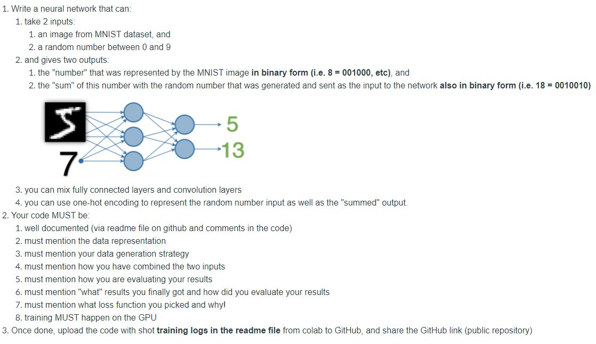
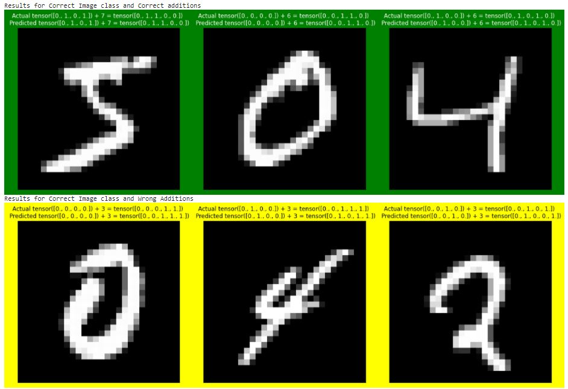
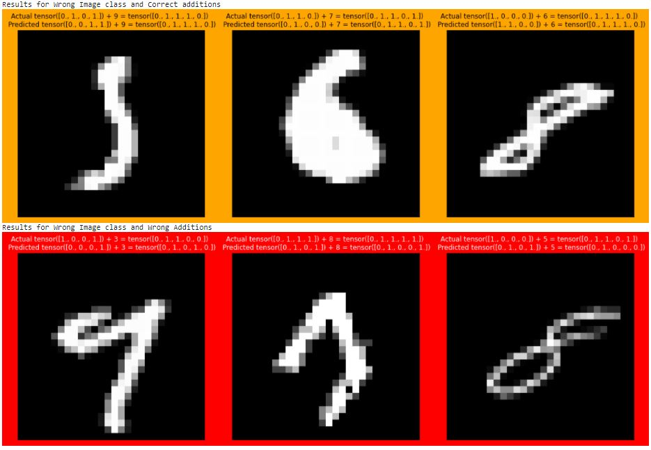

# PyTorch Assignment 

### Dataset Details:

- an image from MNIST Dataset (Input),
- a one hot vector of a randomly generated number between 0 and 9 (Input),
- a label for the image but represented in Binary (Output),
- Sum of MNIST Digit and Random Number represented in Binary (Output)

### Sample Outputs 

